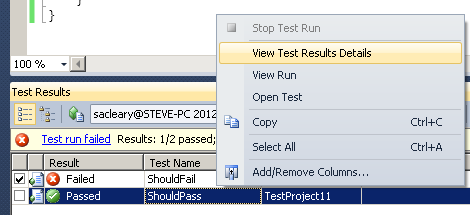
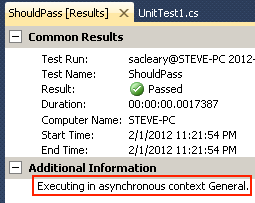

Don't worry - it's not _really_ advanced. You only have one option, really: which type of async context is used to execute the tests.

There are four async contexts you can choose from:
- `None` - Tests are run synchronously. This is the same as just using regular MSTest unit tests.
- `General` - A general-purpose async context. This should be used unless you need another one.
- `WindowsForms` - A WinForms async context. You can use this if you need to test an async component that depends on `Control.Invoke/BeginInvoke` for synchronization.
- `WindowsPresentationFoundation` - A WPF async context. You can use this if you need to test an async component that depends on `Dispatcher.Invoke/BeginInvoke` for synchronization.

The default async context is `General`. You can override the default for the entire test project by using an assembly attribute like this (e.g., in AssemblyInfo.cs):

````C#
using Nito.AsyncEx.UnitTests;

[assembly:AsyncContext(AsyncContext.WindowsPresentationFoundation)](assembly_AsyncContext(AsyncContext.WindowsPresentationFoundation)) // Run all tests in a WPF context unless specified otherwise.
````

`AsyncTextClass` can also take an `AsyncContext` as a named parameter:

````C#
[AsyncTestClass(AsyncContext = AsyncContext.WindowsForms)](AsyncTestClass(AsyncContext-=-AsyncContext.WindowsForms))
public class MoreAdvancedAsyncUnitTests
{
  [TestMethod](TestMethod)
  public async void RequiresWindowsFormsContext()
  { ... }
}
````

You can also apply the `[AsyncContext]` attribute to any `[TestMethod]` that needs a specific one:

````C#
// This test depends on a free-threaded context. It passes under Microsoft's [TestClass](TestClass), but it needs AsyncContext.None to pass under [AsyncTestClass](AsyncTestClass).
[TestMethod](TestMethod)
[AsyncContext(AsyncContext.None)](AsyncContext(AsyncContext.None))
public void RequiresFreeThreadedContext()
{
  Assert.IsNull(System.Threading.SynchronizationContext.Current);
}
````

When the unit test is run, the `AsyncContext` used is determined by these priorities:
1. An `[AsyncContext]` applied to a `[TestMethod]`
2. An `AsyncContext` argument passed to `[AsyncTestClass]`
3. An `[AsyncContext]` applied to the assembly
4. `AsyncContext.General`

The `AsyncContext` used to run a test is displayed in the Test Results Details screen:



